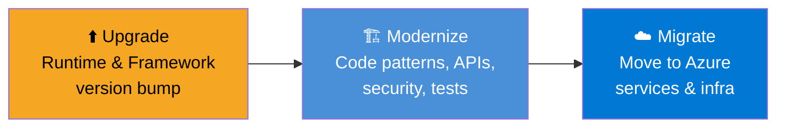
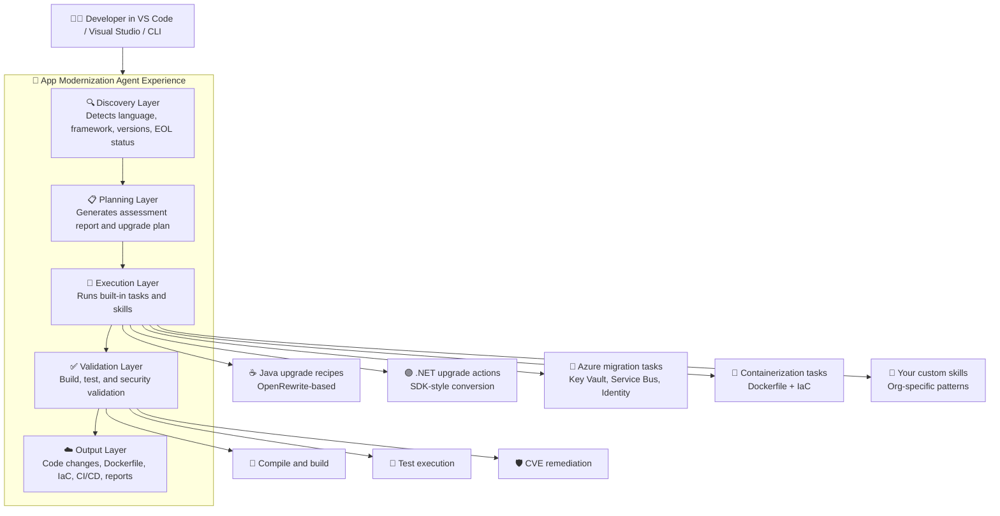
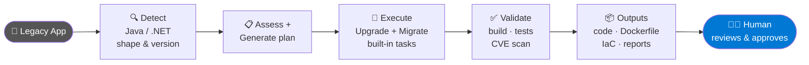

# 🤔 Why App Modernization & Migration?

Before diving into *how* GitHub Copilot can help, it is important to understand *why* modernization is a critical priority for organizations today. 

Legacy applications are everywhere. Most enterprises have a significant portion of their portfolio running on older tech stacks—like Java 8, .NET Framework 4.x, or early versions of Spring Boot. While these applications often run core business processes, they come with growing costs and risks:

- 🚨 **Security Risks (CVEs):** Older frameworks have known vulnerabilities. Once software reaches End-of-Life (EOL), it stops receiving security patches, leaving you exposed to attacks.
- 🐢 **Slower Developer Velocity:** Legacy codebases are often hard to run locally, have slow builds, and are incompatible with modern libraries, lowering developer productivity.
- ☁️ **Cloud Incompatibility:** Many legacy apps (like those running on Windows-only `System.Web`) cannot easily run in Linux containers or take advantage of cloud-native deployment on Azure.
- 💸 **High Maintenance Costs:** Keeping specialized, outdated VMs and infrastructure running is expensive and requires constant manual effort.

Modernizing these applications is the necessary step to escape this technical debt and unlock cloud scale.

## 🏗️ What is Modernization?

**GitHub Copilot modernization** is an AI-powered, agentic, end-to-end solution that:

- 🔍 Analyzes your legacy codebase
- ⬆️ Upgrades language runtimes and frameworks
- ☁️ Migrates code to Azure-native services
- 📦 Containerizes and deploys applications
- 🔒 Fixes security vulnerabilities — automatically

---

## 🔀 Upgrade vs. Modernization vs. Migration — What is the Difference?

These three terms are often used interchangeably, but they mean different things. Understanding the distinction helps you explain where GitHub Copilot App Modernization fits in.

| Term | What it means | Example |
| ---- | ------------- | ------- |
| ⬆️ **Upgrade** | Change a runtime or framework version *within the same technology*. App structure stays largely the same. | Java 8 → Java 21, Spring Boot 2.x → 3.x, .NET Framework 4.8 → .NET 8 |
| 🏗️ **Modernization** | Broader changes to code structure, patterns, and dependencies so the app is ready for modern platforms. Usually includes an upgrade plus API changes, config changes, and security fixes. | Migrating from `System.Web` to minimal hosting, replacing `javax.*` with `jakarta.*`, adding Managed Identity instead of passwords in config |
| ☁️ **Migration** | Moving the app to a new *platform or service*, typically Azure. The app code may not change much, but infrastructure, connectivity, and service dependencies do. | Moving from on-prem SQL Server to Azure SQL, from a message broker to Azure Service Bus, from an on-prem app server to Azure Container Apps |

> 💡 **In practice, GitHub Copilot App Modernization can support all three.**
> It can upgrade the runtime, modernize the code patterns, and help migrate dependencies and infrastructure to Azure — in a single guided workflow, depending on the scenario.



---

## 🧩 Extensions to Install

To get started with GitHub Copilot Modernization, you need to install the provided extensions in your IDE.

**For VS Code & Visual Studio:**

*(Search for "modernization" in the extensions view / marketplace)*

---

## 😰 The Reality Most Teams Face

> **🛑 What is EOL (End of Life)?**
> EOL means the creators of the software (like Oracle, Microsoft, or the Spring Foundation) no longer provide official support, bug fixes, or critically, *security patches*. If a new vulnerability is discovered, you are unprotected and entirely on your own.

**Before upgrading:**

> *"Our Java 8 app works fine... we just can't touch it."*
> *"We've been on .NET Framework 4.5 for 10 years."*
> *"The original developers left 5 years ago, and nobody knows how the core logic works."*

**While upgrading:**

> *"We upgraded one package, and 50 other things broke (Dependency Hell)."*
> *"Every manual upgrade attempt has failed or dragged on for 6 months."*
> *"It finally compiles, but all the runtime tests fail and we don't know why."*

Sound familiar? This is **tech debt at scale** — and it's everywhere.

---

## 🚨 6 Real Problems That Demand Modernization

### 1. 🧟 Legacy Tech Debt

| The Problem | The Reality |
| ----------- | ----------- |
| Java 8 went EOL | No security patches after Dec 2030 extended support |
| .NET Framework 4.x is Windows-only | Can't run on Linux, containers, or cloud-native infra |
| Spring Boot 2.x is end-of-life | No new features, no bug fixes, no community support |
| Old codebases = old patterns | `System.Web`, `Global.asax`, XML config — gone in modern .NET |

> 💀 **The longer you wait, the more expensive the migration becomes.**

---

> **🦠 What is a CVE in simple terms?**
> A CVE is simply a **publicly known security bug**. 
> Imagine your app is a house. A CVE is like a public news alert warning that your specific brand of front door lock is broken, and it even includes instructions on how to pick it. If you don't update the lock, anyone can easily break in.

### 2. 🔐 Security Risk — CVEs in Your Dependencies

```text
⚠️  jackson-databind 2.9.x   → CVE-2019-14379  (Critical 9.8)
⚠️  spring-web 5.2.x         → CVE-2022-22965  (Spring4Shell)
⚠️  log4j-core 2.14.x        → CVE-2021-44228  (Log4Shell)
⚠️  jQuery 1.10.x            → CVE-2019-11358  (High)
⚠️  Newtonsoft.Json older versions → Known vulnerabilities / DoS risks in affected versions
```

- 🔍 Old frameworks = **known exploit surfaces**
- 🚨 Every day you run unpatched code is **a compliance violation waiting to happen**
- 🤖 GitHub Copilot modernization **scans and identifies vulnerable dependencies**, and helps remediate them — such as by upgrading to a safe version — as part of the upgrade workflow

---

### 3. ☁️ Cloud Readiness — Legacy Apps Usually Need Modernization Before Cloud-Native Azure

| What Azure/Cloud Needs | What Your Legacy App Has |
| ---------------------- | ------------------------ |
| Linux containers | `System.Web` (Windows-only) |
| Stateless, horizontal scaling | Session state in-memory |
| Environment-based config | Hardcoded connection strings in `web.config` |
| Managed identity / Key Vault | Passwords in config files |
| Docker / AKS | No Dockerfile, no container support |

> 🚫 **You can't lift-and-shift a .NET Framework 4.8 app into a Linux container.**
> You need to modernize first. Then containerize. Then deploy.

---

### 4. 👩‍💻 Developer Productivity

| Legacy Pain | Cost |
| ----------- | ---- |
| New developer joins — can't run the app locally | 🕐 2–3 days lost onboarding |
| Build takes 15 mins, hot reload doesn't work | ⏳ Death by a thousand cuts |
| "Don't touch that class — nobody knows what it does" | 🧊 Innovation frozen |
| Can't use modern libraries (Spring AI, .NET Aspire) | 🔴 Competitive disadvantage |

> 🐢 Teams on old stacks spend **40–60% of their time maintaining, not building**.

---

### 5. 💸 Cost — Old Infrastructure Is Expensive

| Legacy Approach | Modern Approach |
| --------------- | --------------- |
| Dedicated Windows VMs | Linux containers on AKS / Container Apps |
| Always-on app servers | Scale-to-zero serverless |
| Manual patching & updates | Managed, auto-updated platform |
| Over-provisioned for peak load | Auto-scaling, pay for what you use |

> 💰 Microsoft customers report **30–60% infrastructure cost reduction** after cloud migration.

---

### 6. 📋 Compliance — You Can't Pass an Audit on an EOL Stack

- 🛑 SOC 2, ISO 27001, PCI-DSS all require **actively supported** runtime versions
- 🛑 GDPR / data residency requirements need **cloud-native deployment** options
- 🛑 Cyber insurance providers are now **rejecting policies** for unpatched, EOL software
- ✅ Modernization is not optional — it's a **compliance requirement**

---

## 🤖 Why GitHub Copilot Modernization — Not Just Agent Mode?

> 💬 *"Can't I just open Copilot Agent Mode and ask it to upgrade my project?"*
>
> **You can try. Here's what actually happens.**

---

### ⚔️ Head-to-Head: Agent Mode vs. GitHub Copilot Modernization

| Capability | 💬 Copilot Agent Mode | 🚀 GitHub Copilot Modernization |
| ---------- | --------------------- | ------------------------------ |
| **Knows what to upgrade** | ❓ You must describe the problem | ✅ Automatically detects Java/Spring/.NET versions, EOL status, CVEs |
| **Upgrade plan** | ❌ No structured plan — just ad-hoc responses | ✅ Generates a full, reviewable upgrade plan *before* touching code |
| **Build validation** | ❌ Suggests changes, but doesn't know if they compile | ✅ Runs builds and tests during the workflow — iterates until the project passes |
| **CVE scanning** | ❌ Has no CVE database integration | ✅ Scans dependencies against CVE databases, auto-patches |
| **OpenRewrite / recipe-based upgrades** | ❌ No built-in Java migration recipes | ✅ Uses OpenRewrite for deterministic, tested Java transformations |
| **Domain-specific knowledge** | ⚠️ General-purpose LLM — may hallucinate migration paths | ✅ Microsoft-curated migration patterns for Spring Boot, .NET, Azure |
| **Predefined Azure tasks** | ❌ You must write prompts for every scenario | ✅ Built-in tasks: Key Vault, Service Bus, Managed Identity, etc. |
| **Custom skills / reusable patterns** | ❌ No mechanism to capture & replay patterns | ✅ Convert Git commits into reusable custom skills for your org |
| **Test migration** | ❌ May update tests, may not — unpredictable | ✅ Migrates unit tests alongside production code as part of the plan |
| **Batch / portfolio assessment** | ❌ One project at a time | ✅ Modernization Agent CLI: assess and upgrade 100s of repos |
| **Containerization** | ⚠️ Can generate a Dockerfile if prompted correctly | ✅ Integrated step with IaC (Bicep/ARM) + CI/CD pipelines |

---

### 🎯 In Plain English

| Agent Mode | GitHub Copilot Modernization |
| ---------- | ---------------------------- |
| 🧑‍🍳 Like asking a smart chef "make something with what's in my fridge" | 🍽️ Like having a Michelin-star chef who knows exactly what dish you need, sources the right ingredients, cooks it, and tells you if it tastes right |
| You drive — you need to know the right questions | The tool drives — it knows what modern looks like |
| General-purpose assistant | Domain expert for Java & .NET modernization |

> 💡 **Is App Modernization a Custom Agent or a Custom Skill?**
>
> Neither in the strict VS Code extensibility sense. It is a **purpose-built extension** that delivers an *agent-like experience* inside the Copilot chat panel.
>
> - 🤖 **Think of it as a specialized agent experience** because it orchestrates a full workflow: detect the app type, assess the codebase, create a plan, run transformations, validate builds, scan CVEs, and prepare deployment assets.
> - 🧰 **Under the hood, it delegates to built-in skills and tasks** to do each piece of work: Java upgrade recipes, .NET upgrade actions, Azure migration tasks, containerization, CVE remediation, and validation steps.
> - 🧩 **Your team can extend it with custom skills** when you want organization-specific rules, patterns, or migration steps.
>
> So if someone asks, "Is this like a custom agent or like a custom skill?"
>
> - ✅ **Short answer:** "It's a domain-specific agent experience, not a `.agent.md` file you write yourself."
> - ✅ **Architecture answer:** "That experience is assembled from many built-in skills/tasks, and it can also use custom skills."
>
> *Simple analogy: the agent experience is the project manager; the skills are the specialists doing the actual work.*

### 🧠 What People Should Remember

- 🤖 **Not just a single skill:** a skill performs one specialized action.
- 🧭 **More than plain Agent Mode:** the modernization experience already knows the upgrade and migration workflow.
- 🧰 **More than a single custom agent:** it is an agent-style experience assembled from many domain-specific capabilities.
- 🧩 **Extensible:** your team can add custom skills for internal standards, package rules, architecture constraints, or deployment requirements.

---

### 🧪 Proof: Try This in Agent Mode

Ask Copilot Agent Mode:

```text
Upgrade this Spring Boot 2.x application to Spring Boot 3.x
```

What you get:

- 📋 A few suggestions
- ❌ Some wrong API replacements (hallucinated)
- ❌ No build validation
- ❌ No CVE scan
- ❌ Missing `javax.*` → `jakarta.*` package renames

Now try with GitHub Copilot Modernization:

- ✅ Full upgrade plan generated first
- ✅ 150+ API changes handled via OpenRewrite recipes
- ✅ Build runs, errors caught and fixed automatically
- ✅ CVE scan runs post-upgrade
- ✅ Tests updated alongside production code

---

## 🏁 Bottom Line

> **GitHub Copilot modernization is not a replacement for Agent Mode.**
> It's a **domain-specific agent built on top of Copilot**, purpose-built for the hardest engineering problem most enterprise teams face:
> **Modernizing a decade of legacy code — safely, at scale, with confidence.**

```text
Legacy App  ──►  Assess  ──►  Plan  ──►  Transform  ──►  Secure  ──►  Deploy
              (automatic)  (reviewable)  (validated)  (CVE-clean)  (Azure-ready)
```

---

## 🏛️ Architecture of the App Modernization Agent

> 💡 The extension is **not a single prompt or skill** — it is a layered agent experience where each layer delegates to domain-specific capabilities.

### Component Architecture



### End-to-End Workflow



---

## ❓ Common Questions from Java Developers Using Only Agent Mode

### 1. ❓ Can't I just create my own custom agent, for example `java-modernization`?

Yes, you can create your own custom agent for Java upgrade workflows.

But that is **not the same thing** as using Microsoft's App Modernization experience.

| Your own custom `java-modernization` agent | Microsoft App Modernization agents |
| ------------------------------------------ | ---------------------------------- |
| You define the prompts, flow, rules, and tools yourself | Microsoft already provides a tested modernization workflow |
| You must decide what to check and in what order | Assessment, planning, upgrade, validation, and CVE remediation are already built in |
| You must maintain the logic as frameworks change | Microsoft updates the modernization logic as support evolves |
| Useful for company-specific conventions | Useful for enterprise-grade modernization at scale |

> ✅ **Best way to explain it in the room:**
> Build your own custom agent when you want to encode *your company's policies and preferences*.
> Use Microsoft's modernization agents when you want *domain-specific upgrade and migration expertise already built for Java and .NET*.

### 2. ❓ Why shouldn't I just use my own Java agent for everything?

Because a general custom agent usually starts from prompts and rules, while App Modernization starts from a **mature modernization workflow**.

That means Microsoft's modernization agents already know how to:

- ☕ detect Java and Spring versions
- 🔁 handle common upgrade patterns such as `javax.*` to `jakarta.*`
- 📋 generate an upgrade plan before changing code
- ✅ run validation steps after transformations
- 🔒 scan and fix CVE issues as part of the flow
- ☁️ connect modernization to Azure migration tasks, containerization, and deployment

### 3. ❓ If Agent Mode is powerful, why do I need App Modernization at all?

Because **power is not the same as specialization**.

Agent Mode is flexible. App Modernization is specialized.

- Agent Mode is great when you already know what to ask.
- App Modernization is better when you want the tool to know the modernization journey for you.

### 4. ❓ Can I combine both?

Yes. That is often the best model.

- 🚀 Use App Modernization for the heavy modernization workflow
- 🧩 Use your own custom skills or custom agents for company-specific checks, architecture rules, naming conventions, or internal deployment steps

### 5. ❓ So what is the practical recommendation?

Use the Microsoft modernization agents as the **foundation**.
Layer your own custom skills or custom agent experiences **on top** where your organization has special standards.

> Think of it this way:
>
> - Microsoft provides the modernization engine.
> - Your team adds the organization-specific steering.

### 6. ❓ Is App Modernization or Upgrade a full end-to-end workflow — or just a single step?

**It is a full, multi-step workflow — not a one-shot prompt.**

This is one of the most important distinctions to land in the room.

When you trigger the modernization experience, it does not just suggest code changes. It runs a **structured, sequenced workflow** from start to finish:

| Step | What happens |
| ---- | ------------ |
| 1️⃣ Discovery | The agent scans the codebase, identifies language, framework version, EOL status, and known CVEs |
| 2️⃣ Assessment | A full analysis report is generated — dependencies, risks, migration blockers, and what needs to change |
| 3️⃣ Upgrade Plan | A reviewable plan is produced *before any code is changed* — you see exactly what will happen |
| 4️⃣ Execution | The agent applies transformations: API replacements, dependency upgrades, config changes, test updates |
| 5️⃣ Validation | After each change, the agent rebuilds and runs tests — it iterates until the build passes |
| 6️⃣ CVE Remediation | A post-upgrade security scan identifies remaining vulnerabilities and auto-patches them |
| 7️⃣ Containerization | Generates a Dockerfile and reviews the app for container readiness |
| 8️⃣ Azure Migration | Applies predefined migration tasks (Key Vault, Service Bus, Managed Identity, and more) |
| 9️⃣ Deployment Assets | Produces Bicep/ARM Infrastructure as Code and CI/CD pipeline configuration |

> 🔑 **Key point for the room:**
> Unlike Agent Mode — where you orchestrate every step manually — with GitHub Copilot App Modernization the *workflow is the product*. You review it, you approve it, but you do not have to design it.


---

## 📚 What's Next

| Resource | Link |
| -------- | ---- |
| 🎬 Workshop Demo Scenarios | [README_Demo_Scenarios.md](README_Demo_Scenarios.md) |
| 🗺️ Full Modernization Overview | [README_Modernization_Overview.md](README_Modernization_Overview.md) |
| ☕ Java Upgrade Guide | [README Java Upgrade.md](README%20Java%20Upgrade.md) |
| 🟣 .NET Upgrade Guide | [README_DotNet_Upgrade.md](README_DotNet_Upgrade.md) |
| 📖 Official Docs | [GitHub Copilot modernization docs](https://learn.microsoft.com/en-us/azure/developer/github-copilot-app-modernization/) |
