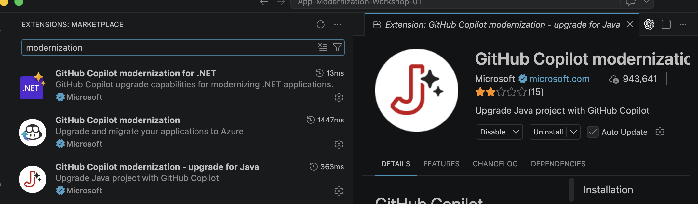

# 🎬 GitHub Copilot App Modernization – Workshop Demo Scenarios

> 📖 **Reference:** [GitHub Copilot Modernization Documentation](https://learn.microsoft.com/en-us/azure/developer/github-copilot-app-modernization/)

---
## 🧩 Extensions to Install

To get started with GitHub Copilot Modernization, you need to install the provided extensions in your IDE.

**For VS Code & Visual Studio:**

*(Search for "modernization" in the extensions view / marketplace)*

## ☕ Scenario 1: Java Upgrade (Java 8 → Java 21 + Spring Boot 3.x)

🔌 **Extension:** GitHub Copilot modernization – upgrade for Java

### 📝 Steps

**Step 1 — Clone the sample repository**

```bash
# Maven-based sample
git clone https://github.com/UW-Madison-DoIT/uportal-messaging

# Gradle-based sample (alternative)
git clone https://github.com/DocRaptor/docraptor-java
```

Open the cloned folder in VS Code, then switch to GitHub Copilot **Agent Mode** and enter:

```
Upgrade project to Java 21 and Spring Boot 3.5 using Java upgrade tools
```

**Step 2 — Follow the official quickstart guide**

📄 [Quickstart: Upgrade a Java project with GitHub Copilot modernization](https://learn.microsoft.com/en-us/azure/developer/github-copilot-app-modernization/quickstart-upgrade)

---

## 🟣 Scenario 2: .NET Assessment & Migration to Azure

🔌 **Extension:** GitHub Copilot modernization for .NET

### 📝 Steps

**Step 1 — Clone the sample repository**

```bash
git clone https://github.com/Azure-Samples/dotnet-migration-copilot-samples
```

Open the **Contoso University** solution from the cloned repository in VS Code, then launch the GitHub Copilot modernization extension from the Activity Bar to start the assessment.

**Step 2 — Follow the official quickstart guide**

📄 [Quickstart: Assess and migrate a .NET project with GitHub Copilot modernization](https://learn.microsoft.com/en-us/dotnet/azure/migration/appmod/quickstart?toc=/azure/developer/github-copilot-app-modernization/toc.json&bc=/azure/developer/github-copilot-app-modernization/breadcrumb/toc.json)

---

## 🎯 Key Capabilities Summary

| 📌 Capability | 📝 Description |
|------------|-------------|
| 🔍 **Assessment & Planning** | Analyze code, config, dependencies; generate modernization plans |
| 🔧 **Code Transformations** | Upgrade runtime/framework, replace APIs, update dependencies |
| 🛡️ **Modernize & Secure** | Build validation, test migration, CVE scanning & fixes |
| 🚢 **Containerize & Deploy** | Dockerfile, IaC, CI/CD pipeline generation |

---

## 🌐 Supported Languages & Frameworks

| 💻 Language | ⬆️ Upgrade Scenarios | ☁️ Migration to Azure |
|----------|------------------|-----------------|
| ☕ **Java** | Java 8/11/17 → 21, Spring Boot 2.x → 3.x | App Service, Container Apps, AKS |
| 🟣 **.NET** | .NET Framework 4.x → .NET 8/9 | App Service, Container Apps, AKS |

---

## 🔗 Useful Links

- 🏠 [Overview](https://learn.microsoft.com/en-us/azure/developer/github-copilot-app-modernization/overview)
- ☕ [Java Upgrade Quickstart](https://learn.microsoft.com/en-us/azure/developer/github-copilot-app-modernization/quickstart-upgrade)
- 🟣 [.NET Migration Quickstart](https://learn.microsoft.com/en-us/dotnet/azure/migration/appmod/quickstart?toc=/azure/developer/github-copilot-app-modernization/toc.json&bc=/azure/developer/github-copilot-app-modernization/breadcrumb/toc.json)
- 🌐 [Languages Supported](https://learn.microsoft.com/en-us/azure/developer/github-copilot-app-modernization/languages)
