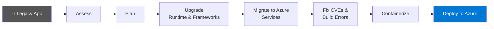

# 🚀 GitHub Copilot App Modernization — Workshop Overview

> 📖 **Official Docs:** https://learn.microsoft.com/en-us/azure/developer/github-copilot-app-modernization/

---

## 🤖 What Is It?

**GitHub Copilot modernization** is an AI-powered, agentic, end-to-end solution that:

- 🔍 Analyzes your legacy codebase
- ⬆️ Upgrades language runtimes and frameworks
- ☁️ Migrates code to Azure-native services
- 📦 Containerizes and deploys applications
- 🔒 Fixes security vulnerabilities — automatically

> 👁️ Humans stay in the loop. Every recommendation is transparent, every change is reviewable.

---

## 🔥 The Problem It Solves

| 😩 Legacy Pain Point | ✅ What Copilot Modernization Does |
|---|---|
| 🦕 Old Java 8/11 codebase, outdated Spring | ⬆️ Upgrades to Java 21 + Spring Boot 3.x |
| 🪟 .NET Framework 4.x app, can't move to cloud | ✨ Migrates to .NET 8 / .NET 9 (modern SDK style) |
| ⏳ Manual migration takes months | ⚡ Generates upgrade plan + executes changes in hours |
| 🚨 CVEs in old dependencies | 🛡️ Scans, identifies, and auto-fixes vulnerabilities |
| 🤷 "We don't know what to change" | 📋 Full assessment report with actionable findings |

---

## 🌐 Supported Languages & Scenarios

```
┌─────────────────────────────────────────────────────────────────┐
│                GitHub Copilot Modernization                      │
├──────────────┬──────────────────┬──────────────────────────────┤
│    Java      │      .NET        │           Python              │
├──────────────┼──────────────────┼──────────────────────────────┤
│ Java 8 → 21  │ .NET Fwk 4.x    │ Semantic Kernel / AutoGen    │
│ Spring Boot  │  → .NET 8/9     │  → Microsoft Agent Framework │
│ Java EE /    │ MVC, Web API,   │                              │
│ Jakarta EE   │ WCF, Blazor     │                              │
│              │                  │                              │
│ Migrate to Azure  (All Languages)                              │
│ Containerize (Dockerfile)  +  Deploy (App Service, ACA, AKS)  │
└────────────────────────────────────────────────────────────────┘
```

---

## 🔄 End-to-End Workflow



---

## 🎯 Four Key Capabilities

### 1. 🔍 Assessment & Planning
- 📊 Scans code, config, and dependencies
- ⚠️ Identifies outdated libraries, breaking API changes, migration blockers
- 📋 Generates a **reviewable upgrade plan** before touching code

### 2. 🔧 Code Transformations
- ⚙️ Uses **OpenRewrite** for Java, SDK-style conversion for .NET
- 🔁 API replacements (`javax.*` → `jakarta.*`, `Global.asax` → `Program.cs`)
- 📦 Predefined tasks for common Azure migration scenarios (secrets, messaging, identity)
- 🧠 **Custom skills** — capture your own patterns and reuse them across projects

### 3. 🛡️ Modernize & Secure
- ✅ Validates every change compiles before committing
- 🧪 Migrates unit tests alongside production code
- 🔒 **CVE scanning** post-upgrade with automatic fixes in Agent Mode

### 4. 🚢 Containerize & Deploy
- 🐳 Generates **Dockerfiles** for any language
- 📜 Creates **Infrastructure as Code** (Bicep/ARM) for Azure
- 🔄 Sets up **CI/CD pipelines** (GitHub Actions / Azure DevOps)

---

## 🛠️ Two Ways to Use It

| 🖥️ Mode | 🔧 Tool | 🎯 Best For |
|------|------|----------|
| **💻 IDE** | VS Code / Visual Studio Extension | 👩‍💻 Developer-led, interactive upgrades |
| **⌨️ CLI (Preview)** | Modernization Agent (`modernize` CLI) | 🏗️ Architects, batch assessment across many repos |

---

## 🧩 Extensions to Install


| 🔌 Extension | 🏢 Publisher | 🎯 Purpose |
|-----------|-----------|--------|
| 🟣 **GitHub Copilot modernization for .NET** | Microsoft | .NET Framework → .NET 8/9 upgrades |
| 🔵 **GitHub Copilot modernization** | Microsoft | Migrate Java & .NET apps to Azure |
| ☕ **GitHub Copilot modernization – upgrade for Java** | Microsoft | Java runtime & Spring Boot upgrades |

> 🆓 All three are free to install from the VS Code Marketplace. Search: `modernization`

---

## 🎬 This Workshop — What We'll Demo

| # | 🎯 Scenario | 💻 Language | 🔧 Tool |
|---|----------|----------|------|
| 1️⃣ | ☕ Upgrade Java 8 → 21 + Spring Boot 3.x | Java | VS Code Extension |
| 2️⃣ | 🟣 Upgrade .NET Framework 4.8 → .NET 8 | .NET | Visual Studio Extension |
| 3️⃣ | 🔍 Assess app for Azure migration | Java / .NET | Copilot Agent Mode |
| 4️⃣ | 📦 Containerize + Deploy to Azure | Both | Copilot Agent Mode |
| 5️⃣ | 🛡️ Scan & fix CVE vulnerabilities | Both | Copilot Agent Mode |

> 📋 Full step-by-step instructions: [README_Demo_Scenarios.md](README_Demo_Scenarios.md)

---

## 💡 Key Takeaways

- ⚡ **Not just suggestions** — Copilot modernization *executes* the changes
- 👁️ **Always reviewable** — upgrade plan generated first, developer approves
- ✅ **Build-validated** — every change is confirmed to compile
- 🔒 **Secure by default** — CVE scanning is part of the workflow
- ♻️ **Reusable** — custom skills capture your org's migration patterns

---

## 🔗 Resources

| 📚 Resource | 🌐 Link |
|----------|------|
| 🏠 Documentation home | https://learn.microsoft.com/en-us/azure/developer/github-copilot-app-modernization/ |
| 🌐 Languages supported | https://learn.microsoft.com/en-us/azure/developer/github-copilot-app-modernization/languages |
| ☕ Java quickstart | https://learn.microsoft.com/en-us/azure/developer/github-copilot-app-modernization/quickstart-upgrade |
| 🟣 .NET upgrade guide | https://learn.microsoft.com/en-us/dotnet/core/porting/github-copilot-app-modernization/how-to-upgrade-with-github-copilot |
| ⌨️ Modernization Agent CLI | https://learn.microsoft.com/en-us/azure/developer/github-copilot-app-modernization/modernization-agent/overview |
